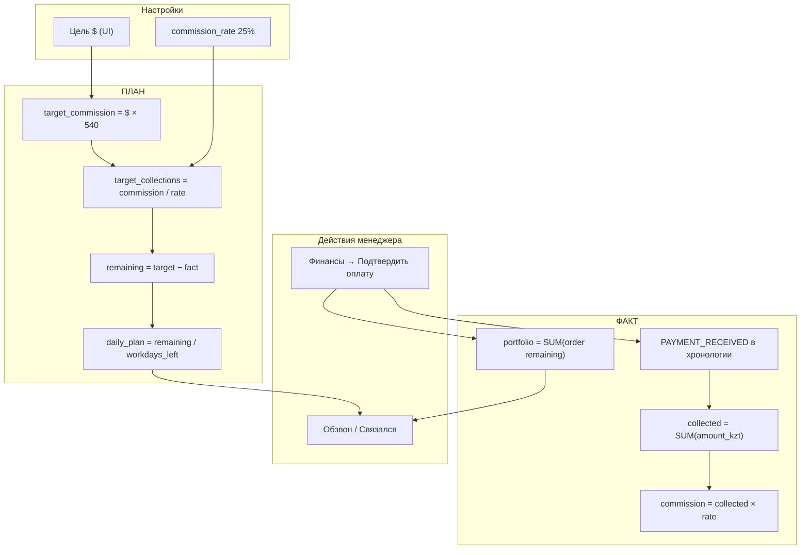

# Таргет, план и факт — как всё считается

Документ описывает, **откуда берутся цифры на дашборде**, как связаны **$ цель**, **сборы клиентов** и **комиссия менеджера**, и чем **план** отличается от **факта**.

---

## 1. Главная идея

| Понятие | Что это | Источник |
|--------|---------|----------|
| **Факт** | То, что уже произошло в CRM | Подтверждённые оплаты, остатки по заказам, часы |
| **План** | Куда нужно прийти к концу месяца | Настройка «Цель $» + формулы |
| **Портфель** | Сколько клиенты ещё должны по документам | Заказы во вкладке «Финансы» |

**План ≠ факт.** Портфель может быть 4+ млн ₸, а факт за месяц — 200 тыс. ₸: деньги в портфеле есть, но пока не зачислены.

---

## 2. Настройки (откуда берётся цель)

Хранятся в таблице `settings`:

| Ключ в БД | Значение по умолчанию | Смысл |
|-----------|----------------------|--------|
| `revenue_target_monthly_usd` | задаётся в UI «Цель $» | Цель дохода в долларах, напр. **2000** |
| `revenue_target_monthly` | пересчитывается автоматически | Цель **комиссии** в ₸ |
| `revenue_target_weekly` | пересчитывается автоматически | Цель недели ≈ 25% месяца |
| `revenue_commission_rate` | **0.25** (25%) | Доля менеджера от сборов клиентов |

**Код:** `server/src/services/revenueService.ts` → `getRevenueConfig()`, `setRevenueConfig()`.

### Пересчёт $ → ₸

```
Курс USD_RATE = 540 (фиксирован в коде)

target_commission_month_kzt = target_monthly_usd × 540
target_weekly_kzt           = target_commission_month_kzt × 0.25
```

**Пример:** цель **$2000**

```
Комиссия за месяц = 2000 × 540 = 1 080 000 ₸
Неделя            ≈ 270 000 ₸ комиссии
```

Меняется в дашборде: кнопка **«Цель $»** → `PUT /api/dashboard/revenue-config`.

---

## 3. Два слоя денег

### 3.1 Сборы (грязные поступления от клиентов)

Сколько клиент **реально заплатил** по документам.

### 3.2 Комиссия (доход менеджера)

```
комиссия = сборы × commission_rate
```

При ставке **25%**:

```
target_collections_month = target_commission_month / 0.25
```

**Пример для $2000:**

```
План сборов за месяц = 1 080 000 / 0.25 = 4 320 000 ₸
```

Именно **~4 млн ₸ сборов** — это план месяца при цели $2000, а не «портфель» и не «на сегодня одним платежом».

---

## 4. ФАКТ — только реальные данные

API: `GET /api/dashboard/plan-fact`  
Сервис: `server/src/services/dashboardPlanFact.ts`  
UI: блок **«Факт»** на дашборде.

### 4.1 Собрано сегодня / за месяц

**Источник:** хронология клиента, события `PAYMENT_RECEIVED`.

- Создаются **только** при ручном подтверждении оплаты во вкладке **Финансы** карточки клиента (`PATCH /api/documents/orders/:id/payment`).
- В `metadata.amount_kzt` пишется **дельта** зачисления (сколько добавили в этот раз), не весь накопительный `client_paid`.

**Код суммирования:** `server/src/services/caseTimeline.ts` → `sumPaymentReceivedInPeriod(from, to)`.

```
collected_today_kzt = SUM(amount_kzt) WHERE event_type = PAYMENT_RECEIVED AND date = сегодня
collected_month_kzt = SUM(amount_kzt) WHERE event_type = PAYMENT_RECEIVED AND date ∈ [1-е число … сегодня]
```

Jarvis и чат **не создают** оплаты — только ручное подтверждение.

### 4.2 Комиссия сегодня / за месяц

```
commission_today_kzt = collected_today_kzt × commission_rate
commission_month_kzt = collected_month_kzt × commission_rate
```

**Код:** `buildRevenueSnapshot()` в `revenueService.ts`.

### 4.3 Портфель (остатки)

**Источник:** таблица `client_document_orders` по всем **неархивным** клиентам.

По каждому заказу (статусы работы: planned, in_progress, done; не cancelled):

```
client_due      = client_due ИЛИ (total_amount − company_pays)
client_remaining = max(0, client_due − client_paid)
```

```
portfolio_remaining_kzt = SUM(client_remaining) по всем заказам
```

**Код:** `server/src/utils/documentPayment.ts` → `orderClientDue()`, `orderClientRemaining()`.

Это **не план** и не факт оплаты — это «сколько ещё могут заплатить» по открытым заказам.

### 4.4 Обещали сегодня (факт ожидания)

**Источник:**

- поле `promised_pay_date` в заказе документа;
- анкета: `pay_promised_date`;
- просрочка `payment_status = overdue`.

**Код:** `collectionWarRoom.ts` → блок `promises.due_today`.

### 4.5 Ставка ₸/час (только факт)

```
hours_worked_month = отработанные часы с 1-го числа по сегодня (будни, 10:00–17:00, таймзона Europe/Kyiv)
hourly_rate_kzt    = commission_month_kzt / hours_worked_month   (если отработано ≥ 0.25 ч)
```

**Код:** `server/src/utils/workHours.ts` → `sumWorkHoursElapsed()`, `workHoursElapsedOnDate()`.

**Пример (июнь, полный месяц):**

```
22 будних дня × 7 ч = 154 ч фонд
1 000 000 ₸ комиссии / 154 ч ≈ 6 494 ₸/ч
```

На 5 июня в знаменателе — **фактически отработанные** часы с 1 июня, не 154.

---

## 5. ПЛАН — расчёт от цели $

### 5.1 Цели месяца

```
target_commission_month_kzt  = из settings (revenue_target_monthly)
target_collections_month_kzt = target_commission_month_kzt / commission_rate
```

### 5.2 Осталось до цели

```
remaining_commission_kzt  = max(0, target_commission − commission_month_fact)
remaining_collections_kzt = max(0, target_collections − collected_month_fact)
```

### 5.3 План на сегодня (главная формула дашборда)

```
workdays_left = количество будних дней от СЕГОДНЯ до конца месяца (включая сегодня)
daily_collections_kzt = ceil(remaining_collections_kzt / workdays_left)
daily_commission_kzt  = ceil(daily_collections_kzt × commission_rate)
```

**Код:** `dashboardPlanFact.ts`.

**Пример: 5 июня 2026, цель $2000, факт за месяц = 0:**

```
Осталось сборов     = 4 320 000 ₸
Будних дней осталось ≈ 18 (с 5 по 30 июня, пн–пт)
План на сегодня     ≈ 4 320 000 / 18 ≈ 240 000 ₸ сборов
Комиссия дня        ≈ 60 000 ₸
```

**4 млн — это остаток месяца, не план одного дня.**

### 5.4 Прогресс-бары

| Бар | Числитель (факт) | Знаменатель (план) |
|-----|------------------|-------------------|
| День · сборы | collected_today_kzt | daily_collections_kzt |
| Месяц · сборы | collected_month_kzt | target_collections_month_kzt |
| Месяц · комиссия | commission_month_kzt | target_commission_month_kzt |

---

## 6. Фазы месяца (дополнительная логика)

**Код:** `server/src/services/collectionPhase.ts`

Используется для подписи `phase_label` и **старого** поля `daily_target_kzt` в `/api/dashboard/revenue` (фазовый план с «догонялкой»).

| День месяца | Фаза | Логика |
|-------------|------|--------|
| 1–15 | Фаза 1 | 75% комиссии месяца ÷ 15 дней + дефицит |
| 16–22 | Фаза 2 | 25% комиссии ÷ 7 дней + дефицит |
| 23–конец | Фаза 3 | остаток ÷ дни до конца месяца |

На дашборде в блоке **«План и факт»** для **дневного плана** используется **простая формула** (остаток ÷ рабочие дни), а не фазовая — чтобы цифра совпадала с «сколько осталось забрать до $2000».

---

## 7. Обзвон и «где поднажать»

**Источник:** `getCallList()` в `revenueService.ts`.

В список попадают клиенты с **остатком > 0** по документам. Приоритет учитывает:

- просрочку оплаты (`daysOverdue`);
- обещание даты (`promiseDate`);
- эскалацию;
- давность контакта.

```
amountKzt      = остаток клиента (client_remaining)
commissionKzt  = amountKzt × commission_rate
```

**Рекомендации «Где поднажать»** (`coach_lines`):

1. Сколько осталось сборов/комиссии до $ цели.
2. План дня и число рабочих дней.
3. Разрыв: план дня минус факт сегодня.
4. Первый клиент из обзвона.
5. Если портфель > остатка плана — «деньги есть, нужны звонки».

---

## 8. Расписание контактов (портфель)

**API:** `/api/dashboard/portfolio-overview`  
**Сервис:** `portfolioIntelligence.ts`

Отдельно от таргета $ — чтобы **не забывать клиентов**:

- последний контакт из хронологии (`MANAGER_NOTE`, `CONSULTATION`, …);
- правило: контакт каждые **2–3 дня**;
- слоты **10:00–17:00** с учётом дня пенсии/зарплаты из анкеты (`pension_pay_day`, `salary_pay_day`, `income_type`, `age`).

Подтверждение звонка: `POST /api/dashboard/portfolio/contact-confirm` → событие в хронологии.

---

## 9. Схема потока данных



---

## 10. API для разработки

| Endpoint | Назначение |
|----------|------------|
| `GET /api/dashboard/plan-fact` | Факт + план + рекомендации |
| `GET /api/dashboard/revenue` | Полный снимок + фазы + pace_potential |
| `GET /api/dashboard/war-room` | Обещания, без контакта, топ остатков |
| `GET /api/dashboard/call-list` | Очередь обзвона |
| `GET /api/dashboard/portfolio-overview` | Расписание дня, сегменты, контакты |
| `PUT /api/dashboard/revenue-config` | Смена цели $ |
| `PATCH /api/documents/orders/:id/payment` | **Единственный** способ зачислить факт оплаты |

---

## 11. Частые ошибки интерпретации

| Ошибка | Как правильно |
|--------|----------------|
| «4 млн — план на сегодня» | 4 млн — **план сборов за месяц** при $2000; день = остаток ÷ рабочие дни |
| Портфель = собрано | Портфель — **долг по заказам**; в факт попадает только после кнопки «Подтвердить» |
| Прогноз = факт | Прогноз (`pace_potential.month`) в блоке «Факт» **не показываем** |
| Сравнить сборы с целью в $ | Сборы сравниваем с **target_collections**; $ — это **комиссия** |
| Jarvis создал оплату | Нет — только ручное подтверждение во **Финансах** |

---

## 12. Файлы в коде

| Файл | Роль |
|------|------|
| `server/src/services/dashboardPlanFact.ts` | План/факт для дашборда |
| `server/src/services/revenueService.ts` | Настройки, снимок дохода, обзвон |
| `server/src/services/collectionPhase.ts` | Фазы месяца |
| `server/src/services/collectionWarRoom.ts` | Обещания, внимание, месячный отчёт |
| `server/src/services/portfolioIntelligence.ts` | Расписание, сегменты, контакты |
| `server/src/services/caseTimeline.ts` | PAYMENT_RECEIVED, суммы за период |
| `server/src/utils/workHours.ts` | 7 ч/день, будни, таймзона Киев |
| `server/src/utils/documentPayment.ts` | Остатки по заказам |
| `client/src/components/dashboard/DashboardPlanFactPanel.tsx` | UI план/факт |

---

## 13. Чеклист: почему цифры «не сходятся»

1. **Цель $** в настройках — точно 2000?
2. **commission_rate** в БД — 0.25?
3. Оплаты подтверждены во **Финансах** (есть события `PAYMENT_RECEIVED`)?
4. Смотришь **сборы** vs **комиссию** — не путаешь?
5. **Портфель** большой, а **факт** маленький — нормально, пока не позвонил и не подтвердил оплату.

---

*Обновлено: июнь 2026 · Lichka CRM*
